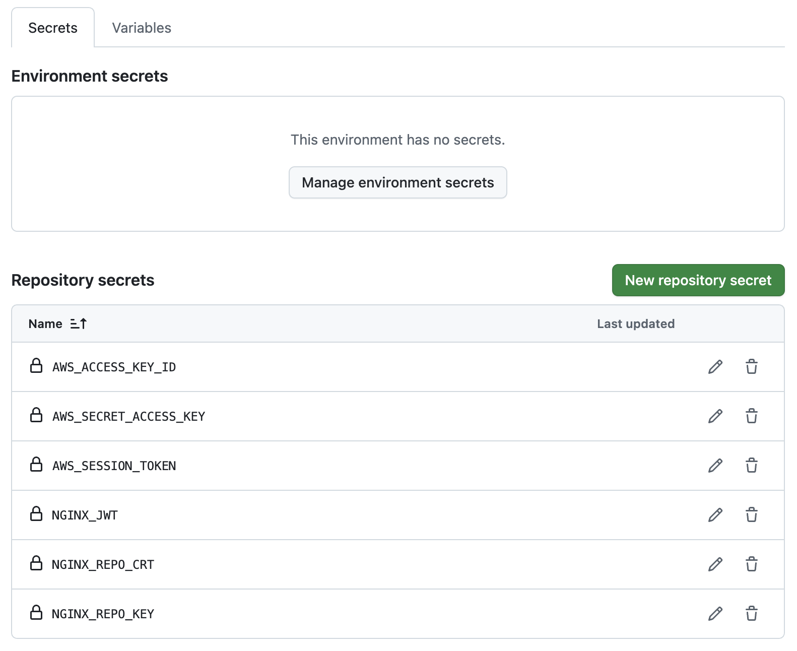
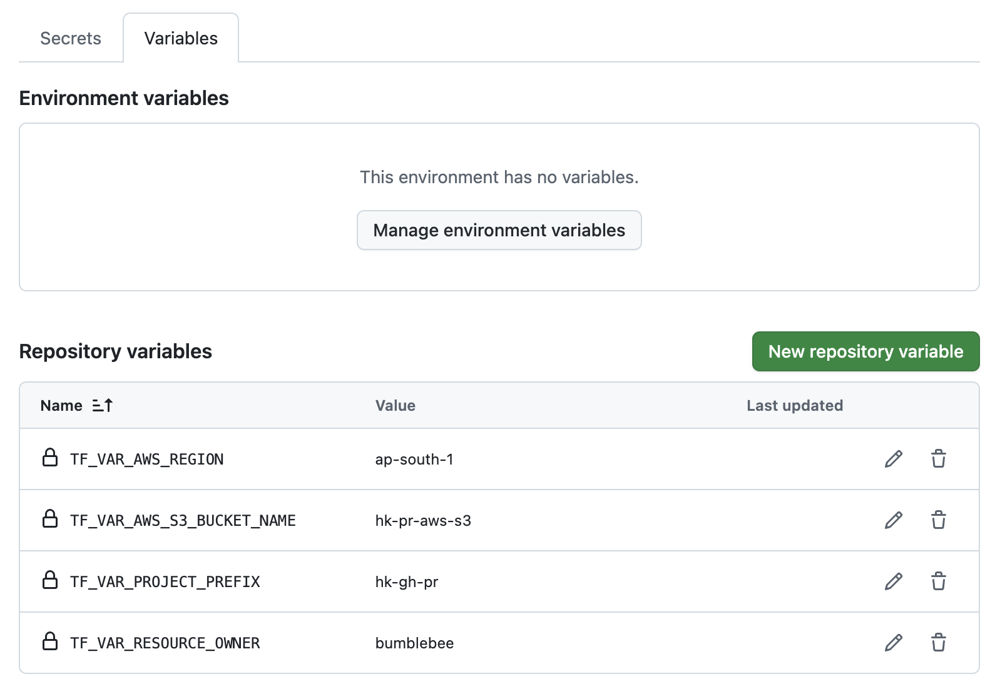
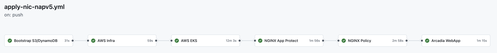
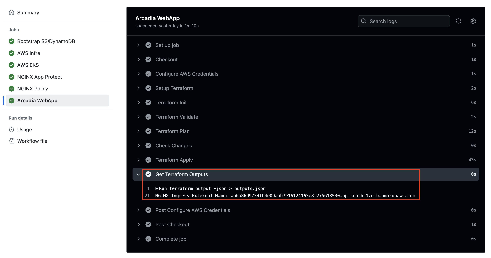
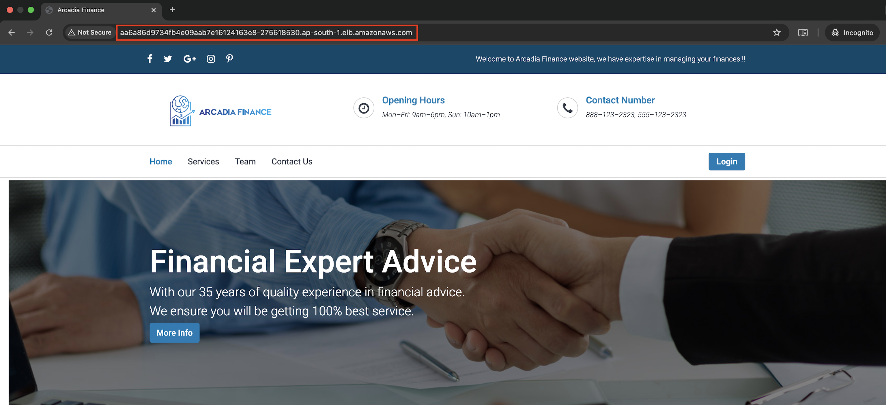
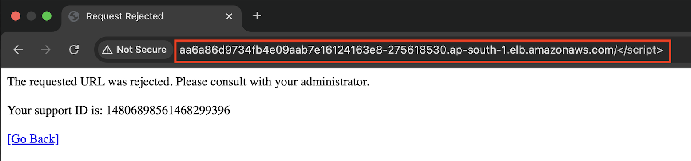

# Deploy NGINX Ingress Controller with App ProtectV5 in AWS Cloud
==================================================================================================

## Table of Contents
  - [Introduction](#introduction)
  - [Architecture Diagram](#architecture-diagram)
  - [Prerequisites](#prerequisites)
  - [Assets](#assets)
  - [Tools](#tools)
  - [GitHub Configurations](#github-configurations)
    - [How to Add Secrets](#how-to-add-secrets)
    - [How to Add Variables](#how-to-add-variables)
    - [Required Secrets and Variables](#required-secrets-and-variables)
  - [Workflow Runs](#workflow-runs)
    - [STEP 1: Workflow Branches](#step-1-workflow-branches)
    - [STEP 2: Policy ](#step-2-Policy)
    - [STEP 3: Deploy Workflow](#step-3-deploy-workflow)
    - [STEP 4: Monitor the Workflow](#step-4-Monitor-the-workflow)
    - [STEP 5: Validation](#step-5-validation)
    - [STEP 6: Destroy Workflow](#step-6-Destroy-workflow)
  - [Conclusion](#conclusion)
  - [Support](#support)
  - [Copyright](#copyright)
    - [F5 Networks Contributor License Agreement](#f5-networks-contributor-license-agreement)

## Introduction
This demo guide provides a comprehensive, step-by-step walkthrough for configuring the NGINX Ingress Controller alongside NGINX App Protect v5 on the AWS Cloud platform. It utilizes Terraform scripts to automate the deployment process, making it more efficient and streamlined. For further details, please consult the official [documentation](https://docs.nginx.com/nginx-ingress-controller/installation/integrations/). Also, you can find more insights in the DevCentral article [F5 NGINX Automation Examples [Part 1-Deploy F5 NGINX Ingress Controller with App ProtectV5]](https://community.f5.com/kb/technicalarticles/f5-nginx-automation-examples-part-1-deploy-f5-nginx-ingress-controller-with-app-/340500).

## Architecture Diagram


## Prerequisites
* [NGINX Plus with App Protect and NGINX Ingress Controller license](https://www.nginx.com/free-trial-request/)
* [AWS Account](https://aws.amazon.com) - Due to the assets being created, the free tier will not work.
* [GitHub Account](https://github.com)

## Assets
* **nap:**       NGINX Ingress Controller for Kubernetes with NGINX App Protect (WAF and API Protection)
* **infra:**     AWS Infrastructure (VPC, IGW, etc.)
* **eks:**       AWS Elastic Kubernetes Service
* **arcadia:**   Arcadia Finance test web application and API
* **policy:**    NGINX WAF Compiler Docker and Policy
* **S3:**        Amazon S3 bucket and IAM role and policy for storage.

## Tools
* **Cloud Provider:** AWS
* **IAC:** Terraform
* **IAC State:** Amazon S3
* **CI/CD:** GitHub Actions

## GitHub Configurations

First of all, fork and clone the repo. Next, create the following GitHub Actions secrets and variable in your forked repo.

### How to Add Secrets

1. Navigate to your GitHub repository
2. Go to **Settings** → **Secrets and variables** → **Actions**
3. Click **New repository secret**
4. Enter the secret name exactly as shown above
5. Paste the secret value
6. Click **Add secret**

### How to Add Variables

1. Navigate to your GitHub repository
2. Go to **Settings** → **Secrets and variables** → **Actions**
3. Click **Variables** tab
4. Click **New repository variable**
5. Enter the variable name exactly as shown above
6. Paste the variable value
7. Click **Add variable**

This workflow requires the following secrets and variable to be configured in your GitHub repository:

### Required Secrets and Variables

| Secret Name            | Type    | Description                                                                                             
|------------------------|---------|---------------------------------------------------------------------------------------------------------|
| `AWS_ACCESS_KEY_ID`     | Secret  | AWS IAM user access key ID with sufficient permissions                                                  |      
| `AWS_SECRET_ACCESS_KEY` | Secret  | Corresponding secret access key for the AWS IAM user                                                    |  
| `AWS_SESSION_TOKEN`     | Secret  | Session token for temporary AWS credentials (if using MFA)                                              |       
| `NGINX_JWT`             | Secret  | JSON Web Token for NGINX license authentication                                                         |    
| `NGINX_Repo_CRT`        | Secret  | NGINX Certificate                                                                                       | 
| `NGINX_Repo_KEY`        | Secret  | Private key for securing HTTPS and verifying SSL/TLS certificates                                       |
| `TF_VAR_PROJECT_PREFIX`     | Variable | Your project identifier name in lowercase letters only - this will be applied as a prefix to all assets | 
| `TF_VAR_AWS_S3_BUCKET_NAME`  | Variable  | Unique S3 bucket name                                                                                   | 
| `TF_VAR_AWS_REGION`        | Variable  | AWS region. Note: The region should support atleast two availability zones                              |
| `TF_VAR_RESOURCE_OWNER`     | Variable | Resource owner name                                                                                     | 

### Github Secrets
 

### Github Variables


## Workflow Runs

### STEP 1: Workflow Branches

Check out a branch with the branch name as suggested below for the workflow you wish to run using the following naming convention.

**DEPLOY**
```sh
git checkout -b gcp-apply-nic-napv5
```
  | Workflow        | Branch Name     |
  |-----------------|-----------------|
  | apply-nic-napv5 | apply-nic-napv5 |

**DESTROY**

  | Workflow          | Branch Name       |
  |-------------------|-------------------|
  | destroy-nic-napv5 | destroy-nic-napv5 |
### STEP 2: Policy 

The repository includes a default policy file named `policy.json`, which can be found in the `AWS/policy` directory.

```hcl
{
    "policy": {
        "name": "policy_name",
        "template": { "name": "POLICY_TEMPLATE_NGINX_BASE" },
        "applicationLanguage": "utf-8",
        "enforcementMode": "blocking"
    }
}
```
 
Users have the option to utilize the existing policy or, if preferred, create a custom policy. To do this, place the custom policy in the designated policy folder and name it `policy.json` or any name you choose. If you decide to use a different name, update the corresponding name in the [`apply-nic-napv5.yml`](https://github.com/f5devcentral/nginx_automation_examples/blob/main/.github/workflows/apply-nic-napv5.yml) and  [`destroy-nic-napv5.yml`](https://github.com/f5devcentral/nginx_automation_examples/blob/main/.github/workflows/destroy-nic-napv5.yml) workflow files accordingly.

  In the workflow files, locate the terraform_policy job and rename `policy.json` to your preferred name if you've decided to change it.
  
   


### STEP 3: Deploy Workflow
 
Commit the changes, checkout a branch with name **`deploy-nic-napv5`** and push your deploy branch to the forked repo
```sh
git commit --allow-empty -m "AWS Deploy"
git push origin apply-nic-napv5
```

### STEP 4: Monitor the workflow

Back in GitHub, navigate to the Actions tab of your forked repo and monitor your build. Once the pipeline completes, verify your assets were deployed in GCP

  


### STEP 5: Validation  

Users can now access the application through the NGINX Ingress Controller Load Balancer, which enhances security for the backend application by implementing the configured Web Application Firewall (WAF) policies. This setup not only improves accessibility but also ensures that the application is protected from various web threats.

  

* Access the application:

  

* Verify that the cross-site scripting is detected and blocked by NGINX App Protect.  

  
  

### STEP 6: Destroy Workflow  

If you want to destroy the entire setup, checkout a branch with name **`destroy-nic-napv5`** and push your destroy branch to the forked repo.
```sh
git checkout -b destroy-nic-napv5
git commit --allow-empty -m "AWS Destroy"
git push origin destroy-nic-napv5
```

Back in GitHub, navigate to the Actions tab of your forked repo and monitor your workflow
  
Once the pipeline is completed, verify that your assets were destroyed  

  

## Support
For support, please open a GitHub issue. Note that the code in this repository is community-supported and is not supported by F5 Networks.

## Copyright
Copyright 2014-2025 F5 Networks Inc.

### F5 Networks Contributor License Agreement
Before you start contributing to any project sponsored by F5 Networks, Inc. (F5) on GitHub, you will need to sign a Contributor License Agreement (CLA).
