# Deploy NGINX Ingress Controller with App ProtectV5 in AWS Cloud
==================================================================================================

## Table of Contents
  - [Introduction](#introduction)
  - [Architecture Diagram](#architecture-diagram)
  - [Prerequisites](#prerequisites)
  - [Assets](#assets)
  - [Tools](#tools)
  - [GitHub Secrets Configuration](#github-secrets-configuration)
    - [Required Secrets](#required-secrets)
    - [How to Add Secrets](#how-to-add-secrets)
  - [Workflow Runs](#workflow-runs)
    - [STEP 1: Workflow Branches](#step-1-workflow-branches)
    - [STEP 2: Modify terraform.tfvars](#step-2-Modify-terraform-tfvars)
    - [STEP 3: Policy ](#step-3-Policy)
    - [STEP 4: Commit Changes](#step-4-Commit-Changes)
    - [STEP 5: Deployment Workflow](#step-5-Deployment-workflow)
    - [STEP 6: Validation](#step-6-validation)
    - [STEP 7: Destroy Workflow](#step-7-Destroy-workflow)
  - [Conclusion](#conclusion)
  - [Support](#support)
  - [Copyright](#copyright)
    - [F5 Networks Contributor License Agreement](#f5-networks-contributor-license-agreement)

## Introduction
---------------
This demo guide provides a comprehensive, step-by-step walkthrough for configuring the NGINX Ingress Controller alongside NGINX App Protect v5 on the AWS Cloud platform. It utilizes Terraform scripts to automate the deployment process, making it more efficient and streamlined. For further details, please consult the official [documentation](https://docs.nginx.com/nginx-ingress-controller/installation/integrations/). Also, you can find more insights in the DevCentral article [F5 NGINX Automation Examples [Part 1-Deploy F5 NGINX Ingress Controller with App ProtectV5]](https://community.f5.com/kb/technicalarticles/f5-nginx-automation-examples-part-1-deploy-f5-nginx-ingress-controller-with-app-/340500).


--------------

## Architecture Diagram


## Prerequisites
* [NGINX Plus with App Protect and NGINX Ingress Controller license](https://www.nginx.com/free-trial-request/)
* [AWS Account](https://aws.amazon.com) - Due to the assets being created, the free tier will not work.
* [GitHub Account](https://github.com)

## Assets
* **nap:**       NGINX Ingress Controller for Kubernetes with NGINX App Protect (WAF and API Protection)
* **infra:**     AWS Infrastructure (VPC, IGW, etc.)
* **eks:**       AWS Elastic Kubernetes Service
* **arcadia:**   Arcadia Finance test web application and API
* **policy:**    NGINX WAF Compiler Docker and Policy
* **S3:**        Amazon S3 bucket and IAM role and policy for storage.

## Tools
* **Cloud Provider:** AWS
* **IAC:** Terraform
* **IAC State:** Amazon S3
* **CI/CD:** GitHub Actions

## GitHub Secrets Configuration

This workflow requires the following secrets to be configured in your GitHub repository:

### Required Secrets

| Secret Name            | Type    | Description                                                              
|------------------------|---------|----------------------------------------------------------------------|
| `AWS_ACCESS_KEY_ID`     | Secret  | AWS IAM user access key ID with sufficient permissions              |      
| `AWS_SECRET_ACCESS_KEY` | Secret  | Corresponding secret access key for the AWS IAM user                |  
| `AWS_SESSION_TOKEN`     | Secret  | Session token for temporary AWS credentials (if using MFA)          |       
| `NGINX_JWT`             | Secret  | JSON Web Token for NGINX license authentication                     |    
| `NGINX_Repo_CRT`        | Secret  | NGINX Certificate                                                   | 
| `NGINX_Repo_KEY`        | Secret  | Private key for securing HTTPS and verifying SSL/TLS certificates   |
| `TF_VAR_AWS_S3_BUCKET_NAME`  | Secret  | Unique S3 bucket name                                            | 
| `TF_VAR_AWS_REGION`        | Secret  | AWS region. Note: The region should support atleast two availability zones   |
### How to Add Secrets

1. Navigate to your GitHub repository
2. Go to **Settings** → **Secrets and variables** → **Actions**
3. Click **New repository secret**
4. Enter the secret name exactly as shown above
5. Paste the secret value
6. Click **Add secret**

## Workflow Runs

### STEP 1: Workflow Branches
**DEPLOY**
  | Workflow     | Branch Name      |
  | ------------ | ---------------- |
  |Apply-nic-napv5| apply-nic-napv5   |

**DESTROY**
  | Workflow     | Branch Name       |
  | ------------ | ----------------- |
  | Destroy-nic-napv5| destroy-nic-napv5   |

### STEP 2: Modify terraform. tfvars  
Rename `infra/terraform.tfvars.examples` to `infra/terraform.tfvars` and add the following data:
  * project_prefix  = "Your project identifier name in **lower case** letters only - this will be applied as a prefix to all assets"
  * resource_owner = "Your-name"

### STEP 3: Policy 

The repository includes a default policy file named `policy.json`, which can be found in the `AWS/policy` directory.

```hcl
{
    "policy": {
        "name": "policy_name",
        "template": { "name": "POLICY_TEMPLATE_NGINX_BASE" },
        "applicationLanguage": "utf-8",
        "enforcementMode": "blocking"
    }
}
```
 
Users have the option to utilize the existing policy or, if preferred, create a custom policy. To do this, place the custom policy in the designated policy folder and name it `policy.json` or any name you choose. If you decide to use a different name, update the corresponding name in the [`apply-nic-napv5.yml`](https://github.com/f5devcentral/nginx_automation_examples/blob/main/.github/workflows/apply-nic-napv5.yml) and  [`destroy-nic-napv5.yml`](https://github.com/f5devcentral/nginx_automation_examples/blob/main/.github/workflows/destroy-nic-napv5.yml) workflow files accordingly.

  In the workflow files, locate the terraform_policy job and rename `policy.json` to your preferred name if you've decided to change it.
  
   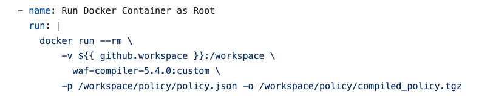


### STEP 4: Commit changes


   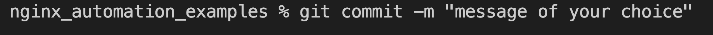
   

### STEP 5: Deployment Workflow  

* **Step 1**: Check out a branch for the deploy workflow using the following naming convention  
  * nic-napv5 deployment branch: apply-nic-napv5
    
   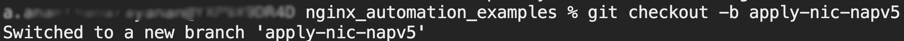

* **Step 2**: Push your deploy branch to the forked repo
   
   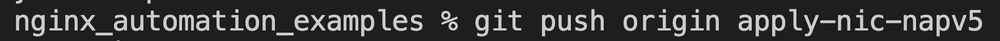

* **Step 3**: Back in GitHub, navigate to the Actions tab of your forked repo and monitor your build
  
   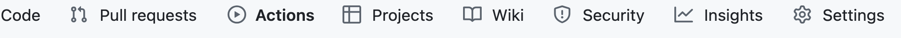

* **Step 4**: Once the pipeline completes, verify your assets were deployed to AWS  

  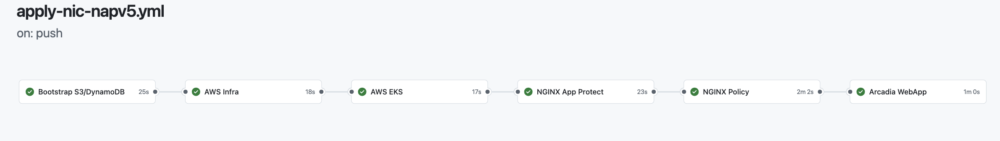


### STEP 6: Validation  

Users can now access the application through the NGINX Ingress Controller Load Balancer, which enhances security for the backend application by implementing the configured Web Application Firewall (WAF) policies. This setup not only improves accessibility but also ensures that the application is protected from various web threats.

  

* With malicious attacks:

  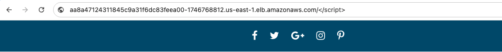

* Verify that the cross-site scripting is detected and blocked by NGINX App Protect.  

  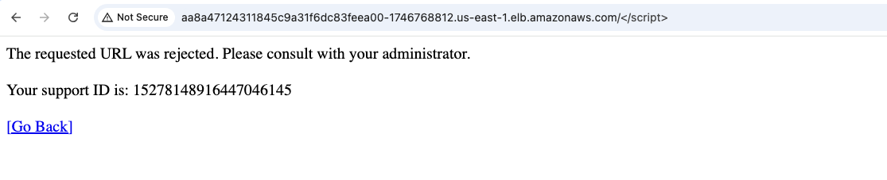
  

### STEP 7: Destroy Workflow  

* **Step 1**: From your main branch, check out a new branch for the destroy workflow using the following naming convention  
  * nic-napv5 destroy branch: destroy-nic-napv5  
  
  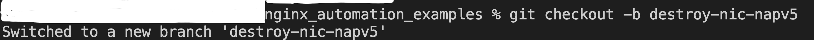

* **Step 2**: Push your destroy branch to the forked repo  

  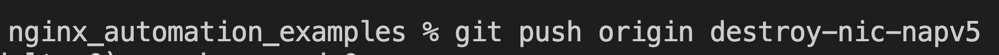

* **Step 3**: Back in GitHub, navigate to the Actions tab of your forked repo and monitor your workflow
  
  

* **Step 4**: Once the pipeline is completed, verify that your assets were destroyed  

  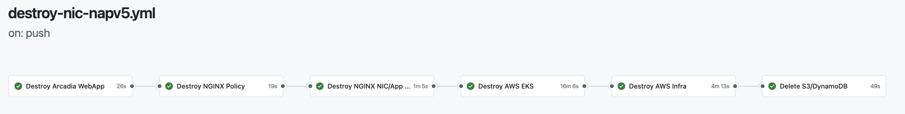


## Support
For support, please open a GitHub issue. Note that the code in this repository is community-supported and is not supported by F5 Networks.

## Copyright
Copyright 2014-2020 F5 Networks Inc.

### F5 Networks Contributor License Agreement
Before you start contributing to any project sponsored by F5 Networks, Inc. (F5) on GitHub, you will need to sign a Contributor License Agreement (CLA).

