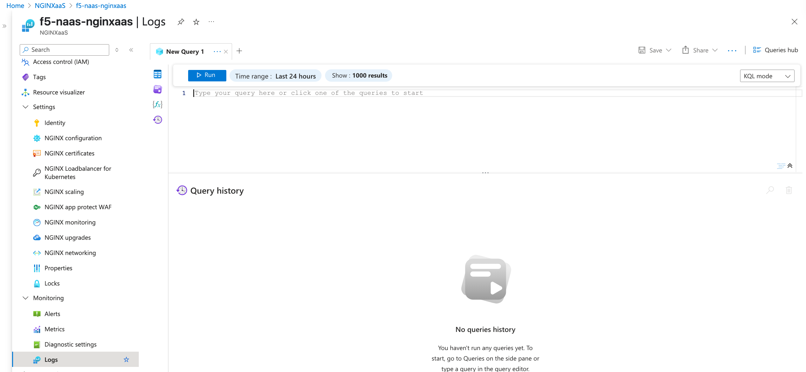

# Deploy F5 NGINXaaS for Azure with App Protect, a Demo Application, and Azure Grafana.
==================================================================================================

## Table of Contents
  - [Introduction](#introduction)
  - [Architecture Diagram](#architecture-diagram)
  - [Prerequisites](#prerequisites)
  - [Assets](#assets)
  - [Tools](#tools)
  - [GitHub Configurations](#github-configurations)
    - [How to Add Secrets](#how-to-add-secrets)
    - [How to Add Variables](#how-to-add-variables)
    - [Required Secrets and Variables](#required-secrets-and-variables)
  - [Workflow Runs](#workflow-runs)
    - [STEP 1: Workflow Branches](#step-1-workflow-branches)
    - [STEP 2: Policy ](#step-2-Policy)
    - [STEP 3: Deploy Workflow](#step-3-deploy-workflow)
    - [STEP 4: Monitor the Workflow](#step-4-Monitor-the-workflow)
    - [STEP 5: Validation](#step-5-validation)
    - [STEP 6: Visualize the metrics in Azure Grafana](#step-6-Visualize-the-metrics-in-Azure-Grafana)
    - [STEP 7: Analyze NGINX logs in Azure Log Analytics workspaces](#step-7-Analyze-NGINX-logs-in-Azure-Log-Analytics-workspaces)             
    - [STEP 8: Destroy Workflow](#step-7-Destroy-workflow)
  - [Conclusion](#conclusion)
  - [Support](#support)
  - [Copyright](#copyright)
    - [F5 Networks Contributor License Agreement](#f5-networks-contributor-license-agreement)

## Introduction
This demo guide serves as a valuable resource, offering a detailed step-by-step process for setting up a Terraform deployment that creates an F5 NGINX as a Service (NGINXaaS) on Azure with NGINX App Protect. The NGINXaaS will provide advanced load balancing for demo applications that operate across two virtual machines. Furthermore, this guide will help you deploy Azure Grafana to effectively visualize the metrics of NGINX and the virtual machines, allowing you to assess system performance and optimize your deployment.

## Architecture Diagram


## Prerequisites
* [Azure Account](https://portal.azure.com/) - Due to the assets being created, the free tier will not work.
* [GitHub Account](https://github.com)

## Assets
* **Log:**       Azure logging for NGINXaaS
* **Infra:**     NIGNXaaS and Virtual machine Infrastructure (Vnet, Subnets)
* **NIC/NAP:**   NGINX Ingress Controller for Kubernetes with NGINX App Protect (WAF and API Protection)
* **Policy:**    NGINX WAF Compiler Docker and Policy
* **NGINX:**     NGINX configuration files
  

## Tools
* **Cloud Provider:** Azure
* **IAC:** Terraform
* **CI/CD:** GitHub Actions

## GitHub Configurations

First of all, fork and clone the repo. Next, create the following GitHub Actions secrets and variables in your forked repo.

### How to Add Secrets

1. Navigate to your GitHub repository
2. Go to **Settings** → **Secrets and variables** → **Actions**
3. Click **New repository secret**
4. Enter the secret name exactly as shown above
5. Paste the secret value
6. Click **Add secret**

### How to Add Variables

1. Navigate to your GitHub repository
2. Go to **Settings** → **Secrets and variables** → **Actions**
3. Click **Variables** tab
4. Click **New repository variable**
5. Enter the variable name exactly as shown above
6. Paste the variable value
7. Click **Add variable**

This workflow requires the following secrets and variables to be configured in your GitHub repository:

### Required Secrets and Variables

| Secret Name            | Type    | Description                                                                                             
|------------------------|---------|---------------------------------------------------------------------------------------------------------|
|`AZURE_CREDENTIALS`    | Secret   | Azure credentials in JSON format {"clientId":"yout client ID","clientSecret":"your client secret","subscriptionId":"your subscription ID","tenantId":"your tenant ID"} |      
| `AZURE_REGION`         | Variable | Azure region name in which you would like to deploy your resources                                                   |                                            |    
| `TF_VAR_ssh_public_key` | Secret  |  Public key of your laptop to SSH into the VM
| `PROJECT_PREFIX` | Variable | Your project identifier name in lowercase letters only - this will be applied as a prefix to all assets  | 
| `ADMIN_IP`       | Secret | Your local machine ip                                                    | 
| `AZURE_REGION`   | Variable  | Azure region                           |                                                                                   | 

### Github Secrets
 

### Github Variables


## Workflow Runs

### STEP 1: Workflow Branches

Check out a branch with the branch name as suggested below for the workflow you wish to run using the following naming convention.

**DEPLOY**
```sh
git checkout -b nginxaas-apply
```
  | Workflow        | Branch Name     |
  |-----------------|-----------------|
  | nginxaas-apply | nginxaas-apply |

**DESTROY**

  | Workflow          | Branch Name       |
  |-------------------|-------------------|
  | destroy-nginxaas | destroy-nginxaas |

### STEP 2: Policy 


### STEP 3: Deploy Workflow
 
Commit the changes and push your apply branch to the forked repo
```sh
git commit --allow-empty -m "NGINXaaS Deploy"
git push origin nginxaas-apply
```

### STEP 4: Monitor the workflow

Back in GitHub, navigate to the Actions tab of your forked repo and monitor your build. Once the pipeline is complete, verify that your assets were deployed in Azure.

  


### STEP 5: Validation  

Users can now access the application through the NGINXaaS endpoint IP, which enhances security for the upstream application by implementing the configured Web Application Firewall (WAF) policies. This setup not only improves accessibility but also ensures that the application is protected from various web threats.

  

* Access the application:

  

* Verify that the cross-site scripting is detected and blocked by NGINX App Protect.  

  


### STEP 6: Visualize the metrics in Azure Grafana  

To visualize NGINX and virtual machine metrics effectively, you can leverage Grafana, a robust analytics and monitoring platform. With Grafana, you can create customizable dashboards that offer an intuitive interface for tracking various performance metrics. This makes it easier to gain insights and optimize your systems effectively.

Within the repository, you'll find a `dashboard.json` file. To use it, update the file with your resource group name, region, NGINXaaS name, and the names of your virtual machines. 

```json
"templating": {
  "list": [
    {
      "name": "resourceGroup",
      "type": "constant",
      "query": "YOUR RESOURCE GROUP NAME",
      "label": "Resource Group",
      "hide": 2
    },
    {
      "name": "region",
      "type": "constant",
      "query": "YOUR AZURE REGION NAME",
      "label": "Region",
      "hide": 2
    },
    {
      "name": "nginxResource",
      "type": "constant",
      "query": "YOUR NGINXaaS NAME",
      "label": "NGINX Resource",
      "hide": 2
    },
    {
      "name": "vm1",
      "type": "constant",
      "query": "YOUR VM-1 NAME",
      "label": "VM 1",
      "hide": 2
    },
    {
      "name": "vm2",
      "type": "constant",
      "query": "YOUR VM-2 NAME",
      "label": "VM 2",
      "hide": 2
    }
  ]
}


After you’ve made those updates to the dashboard.json file, import it into Grafana to start visualizing the metrics for NGINXaaS and your virtual machines.

 
 
 
### STEP 7: Analyze NGINX logs in Azure Log Analytics workspaces

To effectively check the NGINX and security logs, start by navigating to the Azure portal and selecting your NGINXaaS deployment. From there, head to the monitoring tab and choose the logs option.

 

Here, you can utilize KQL queries to analyze and review the logs. This will help you gain valuable insights into your deployment’s performance and security.

 
 

You can find a sample KQL query on the NGINXaaS documentation page [documentation](https://docs.nginx.com/nginxaas/azure/app-protect/enable-logging//).

### STEP 8: Destroy Workflow  

If you want to destroy the entire setup, checkout a branch with name **`destroy-nginxaas`** and push your destroy branch to the forked repo.
```sh
git checkout -b destroy-nginxaas
git commit -- allow-empty -m "NGINXaaS Destroy"
git push origin destroy-nginxaas
```

Back in GitHub, navigate to the Actions tab of your forked repo and monitor your workflow.
  
Once the pipeline is completed, verify that your assets were destroyed.  

  

  

## Support
For support, please open a GitHub issue. Note that the code in this repository is community-supported and is not supported by F5 Networks.

## Copyright
Copyright 2014-2025 F5 Networks Inc.

### F5 Networks Contributor License Agreement
Before you start contributing to any project sponsored by F5 Networks, Inc. (F5) on GitHub, you will need to sign a Contributor License Agreement (CLA).
